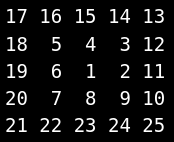
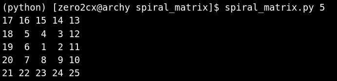
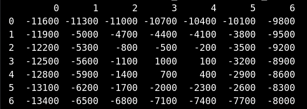
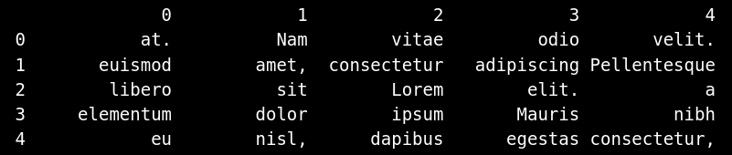
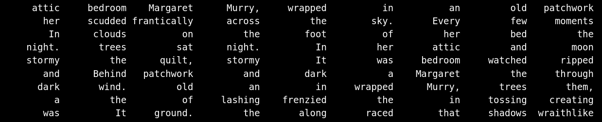

# SpiralMatrix

## Construct a square 2-d matrix with an outward-spiraling series of elements

A matrix in the context of this code module is an array whose membership is
made up of a number of other arrays that are all uniform in size. The
assembled array-of-arrays that is generated forms a two-dimensional grid
made up of individual cells.

A spiral matrix is a particular type of squared-shaped matrix where each
cell is populated with a progression of elements of a series. The spiral in
the name refers to the condition that the cells are filled using a pattern
that conforms to a tightly-wound spiral. The spiral progression begins in
the center cell. From there, the progression spirals outward moving from
cell to cell, filling each one with an element of the series. Ultimately,
each cell in the matrix is populated with one element of the series.

This remainder of this document details the practical application of executing
SpiralMatrix from the command-line. For documentation on usage of SpiralMatrix
when importing the code as a Python 3.x module, please [click here](./docs/SpiralMatrix.md "The Spiral Matrix module API").

#### Required parameter

    DIMENSION
        This parameter is an integer value, and is limited
        to odd numbers only. This count of rows and columns
        constitute the constructed size of the the square-
        shaped 2-d matrix. (REQUIRED)

#### General-purpose options

Column and row axis-labels along the top- and left-side can be prefixed to
the printed output. Proceeding outward from the center cell in one compass
direction or bearing, i.e East, North, West, or South, initiates the
progression of the spiral. The spiral can progress in either a clockwise or
counter-clockwise manner.

    --axes
        This parameter-less option enables or disables the
        prefixing of column- and row-axes labels along the
        top- and left-side of the printed output.
        (default: False)

    --bearing EAST | NORTH | WEST | SOUTH
        This compass bearing (E, N, W, or S) specifies
        the direction that is used to proceed initially
        outward from the center of the matrix.
        (default: E)

    --right
        This parameter-less option generates a spiral
        which progresses in a clockwise manner. Not for use
        with 'left'. (default: not used)

    --left
        This parameter-less option generates a spiral
        which progresses in a counter-clockwise manner,
        which is the default behavior. Not for use with
        'right'. Included for completeness.

#### Options for the default style of integer-populated matrix cells

The default style for the generated matrix consists of the series of
integers that begin with 1 and then increments by 1 for each member of the
series. Either of these integer values may be modified in order to change
the generated matrix's cell contents. Any positive or negative integer, or
zero, is acceptable to occupy the center cell that begins the spiral. The
increment integer must be a positive or negative, non-zero integer.

Use of the following options will modify the implementation of the default
behavior.

    --center INTEGER
        This integer value is used to populate the center
        cell that begins the spiral. (default: 1)

    --step INTEGER
        This integer value is used to increment the next
        cell's value as the spiral progresses from cell to
        cell. (default: 1)

#### Options for the alternative style of element-populated matrix cells

As an alternative to the population of the cells of the matrix with the
series of incrementing integers, a string of whitespace-delimited text
elements can be supplied. This string of elements might consist of any
combination of words, numbers, punctuation, or whitespace. The text
elements will be read from a file or stdin, or provided in a string via
the command-line.

Use of either of the following options will replace the default behavior of
populating the cells with the series of incrementing integers.

    --file FILENAME
        The specified file should contain some amount of
        whitespace-delimited text elements. The cells of
        the matrix are then populated using these elements.
        Usage of the 'words' option is excluded when using
        this option. (default: not used)

    --words [STRING]
        This string of whitespace-delimited text elements
        is used to populate the cells of the matrix. When
        this option is present with no string parameter
        given, then string is read from stdin. When
        utilizing stdin for string input, this option needs
        to be the last option provided on the command-line.
        Usage of the 'file' option is excluded when using
        this option. (default: not used)

###### PyPI: [presently unsubmitted]
###### Repo: [https://github.com/zero2cx/spiral-matrix](https://github.com/zero2cx/spiral-matrix)
###### License: GPL3+
###### Document version: 1.0
###### Modified: 01/13/2018
###### Author: David Schenck
